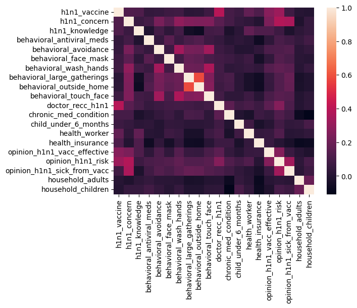

# Vaccine utilization project

## Business Understanding

The client is a leader in the field of health care.  The client has resources at their disposal that can be used to encourage non-vaccinated persons to become vaccinated. It would be beneficial to the client to know what groups of persons are less likely to be vaccinated in order to make the best use of the client's resources.  Therefore, it would be helpful for the client to have a model that could predict which persons are less likely to be vaccinated based on various known factors, related to the person's background, views and behaviors, and also it would be helpful to know more generally which of these factors leads a group to be less or more likely to be vaccinated.  This model and knowledge would facilitate efforts to reach persons individually and as groups in order to efficiently encourage vaccination. 

See the [data](./data) or review this [presentation](./Presentation_VaccineProject.pdf).

## Data Understanding

The data comes from the National 2009 H1N1 Flu Survey conducted by the United States after the outbreak of the virus in 2009.  The survey covers various topics included one's background, views and behaviors.  The survey also covers whether one has been vaccinated against the H1N1 virus, which will be the target variable for this project.  More specifically, the potential predictor variables include socio-economic related factors, views about vaccines, and health-related behaviors and statuses (e.g., health insurance and doctor recommendation.) Given that H1N1 can be categorized as a risky virus, the data, though H1N1 specific, can be thought of as analagous to any risky virus such that insights from the data will be applicable to future viral outbreaks. 

21% of respondents received the H1N1 vaccine. Half the features are categorical in nature as opposed to numerical. (Of the float and integer type features, about half are binary/categorical.)  The columns with most missing data have about 10,000 of 27,000 missing.  Features with signficant correlation to the target variable are doctor reccomendation, opinion of virus risk, and opinion of vaccine effective. These predictor variables are not highly correlated amongst each other. The survey seems to be fairly cross-sectional in terms of various background factors. 

Correlation matrix

## Data Preparation

Separate predictor variables and target variables from unused data, fill in missing values and then split both into train and test sets.  

## Data Modeling

In the data modeling section, I start from a baseline logistic regression using three features and the response variable (whether the person has received the H1N1 vaccine).  From there, I explore non-parametric models, starting with a fairly simple decision tree model.  Based on the the results from this model, a more complex tree model is fitted and evaluated.

### First model

- Train and test accuracies:[81.98%, 81.33%]
- The number of false positives, 252, seems material but low, given the roughly 27,000 predicitions.
- Doctor recommendation appears to be the most important feature

### Initial tree model

- Train and test accuracies:[82.00%, 81.05%]
- Accuracy scores are very similar for test and train set (also to logistic regression).  Since there appears to be underfitting (marginally higher accuracy on test set), it may make sense to build a more complex tree to try to pick up on more patters in the training set.

### Final model (tree)

- Train and test accuracies:[82.02%, 81.56%]
- The accuracy scores in this more complex tree are highly similar to the initial tree, however the training and test scores have slightly improved and converged.  This suggests that we now have a marginally improved model. 
- The confusion matrix is similar for both iterations of the tree model (269 false positives vs. 266 in final), as expected given there was only a slight improvement in accuracy.  Compared to the baseline model, even though there are greater false positives in the trees, our greatest concern, our total correct predictions, has increased.  Thus even though the tree models would incorrectly classify more unvaccinated persons and therefore result in less resources for that population, given the higher accuracy and greater correct predictions (and lower false negatives) of the big_tree model (see below), resources would be better conserved and allocated by relying on the big_tree model.

## Results, Recommendations 

- The results show that the **big_tree model is the preferred model** given its higher accuracy on the training and test sets compared to both the first tree iteration and the baseline logistic regression model.  
- Given that this model performs better than the other models and better than the simple strategy of guessing the majority class for each prediction, **it is recommended that this model be used to predict whether or not individuals have been given the vaccine** for any virus similar to H1N1, so that resources can be allocated efficiently based on one's vaccine status.  
- More generally, the models show us that the three factors, **presence of a doctor reccomendation, opinion of virus risk, and opinion of vaccine effectiveness**, are significantly related to whether one has received the vaccine. This suggest that it would be beneficial to both increase outreach to those with low presence of these factors and to provide outreach that may could educate and provide resources so that such persons may become more likely to receive a vaccine. 

### Limitations

- The core limitation is that there is much room for improvement in the accuracy level of the final model. While the accuracy of the final model is 82%, a strategy of simply guessing that all persons have not received the vaccine would result in a similar 79% accuracy.  Also note that iteratively, only slight improvement was made, given similar accuracies and only 1 more correct prediction in final model as compared to baseline.

## Repository Structure

- data
- images
- README.md
- README.pdf
- Presentation_VaccineProject.pdf
- VaccineProjectNotebook.ipynb
- VaccineProjectNotebook.pdf